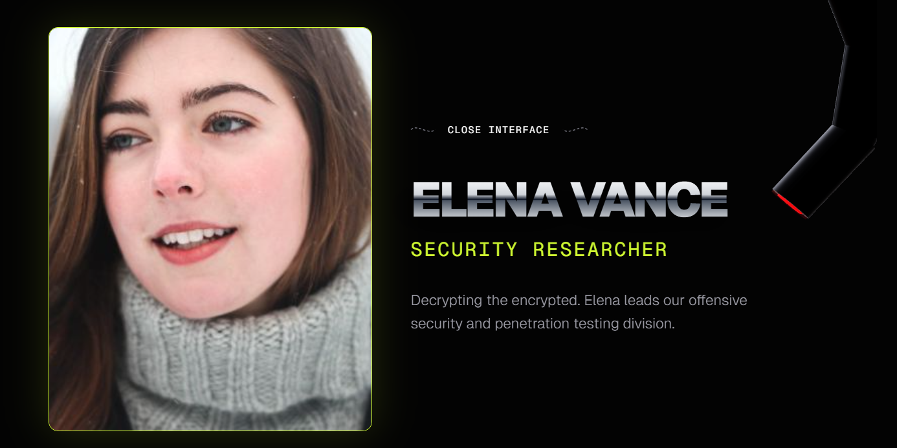
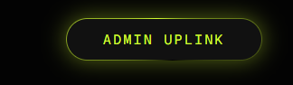

# 🦾 ARMATRIX.
**Advanced Personnel Management & Team Page Interface**

> "Experience the intersection of high-fidelity 3D interaction and robust backend architecture."

This project is a dynamic and visually engaging personnel directory built for the **Armatrix** brand. It showcases a blend of full-stack engineering, procedural 3D graphics, and cinematic UI/UX design.

---

## 🔗 Live Deployments

* **Frontend (Vercel):** [https://armatrix-team-page-delta.vercel.app](https://armatrix-team-page-delta.vercel.app)
* **Backend API (Railway):** [https://armatrixteampage-production.up.railway.app](https://armatrixteampage-production.up.railway.app)
* **API Docs:** [https://armatrixteampage-production.up.railway.app/docs](https://armatrixteampage-production.up.railway.app/docs)

---

## ✨ Key Features

### 💎 The Interaction Layer
* **Mechanical Shutter Cards:** Each team member is housed in a custom-built card featuring a mechanical iris reveal effect, implemented using SVG paths and Framer Motion keyframes.
* **3D Robotic Arm Probe:** A Three.js-powered robotic arm that hovers over the selected personnel. It features cursor-tracking kinematics and a reactive "Alert" state when scanning data.
* **Cinematic Intro Sequence:** A choreographed sequence that uses a state-machine approach to orchestrate typography and layout transitions before revealing the directory.

### ⚙️ The Dynamic Engine
* **Smart Layout Morphing:** The interface automatically switches between a fanned "deck" layout and a 360-degree "Iris Array" based on the size of the team roster.
* **Silver Chrome Rendering:** Custom CSS gradients and lighting maps create a high-fidelity metallic shine on UI elements.

### 🛡️ The Admin Uplink (Full CRUD)
* **Database Management:** A secure, in-theme Admin Panel allows for real-time creation, deletion, and modification of personnel records.
* **Live Synchronization:** Changes made via the Admin Uplink are instantly reflected across the 3D-integrated frontend.

---

## 🛠️ Technology Stack

| Category | Technology |
| :--- | :--- |
| **Frontend** | Next.js 15, React, Tailwind CSS |
| **Animation** | Framer Motion |
| **3D Graphics** | Three.js, React Three Fiber, @react-three/drei |
| **Backend** | Python 3.12, FastAPI |
| **Data Modeling** | Pydantic |
| **Deployment** | Vercel (Frontend), Railway (Backend) |

---

## 🚀 Local Setup

### Backend (FastAPI)
1. Navigate to the `/backend` directory.
2. Install dependencies: `pip install -r requirements.txt`
3. Start the server: `uvicorn main:app --reload`

### Frontend (Next.js)
1. Navigate to the `/frontend` directory.
2. Install dependencies: `npm install`
3. Run the development server: `npm run dev`

---

## 🧠 Key Technical Challenges Overcome

* **Procedural 3D Rigging:** Creating a bone-linked 3D hierarchy directly in code without external modeling software to ensure performance and interactivity.
* **Animation Sync:** Synchronizing Framer Motion’s `layoutId` morphing with dynamic CSS grid shifts to maintain a glitch-free experience.
* **Fullstack Orchestration:** Implementing a RESTful API with strict CORS configurations for secure cross-origin communication between Vercel and Railway.

---

**Developed by Sreeja Das** *Creative Developer & Fullstack Engineer*